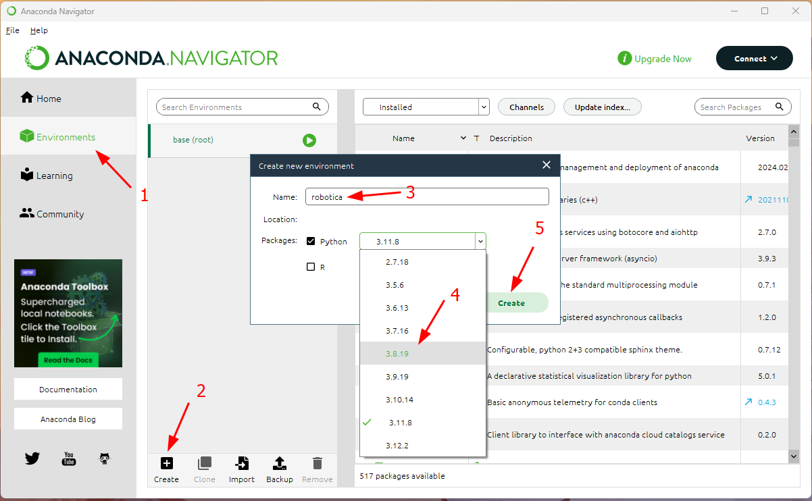
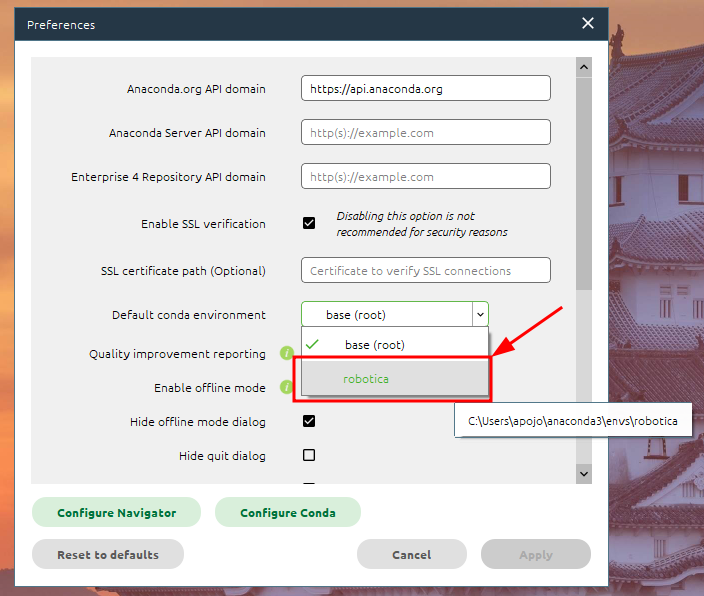
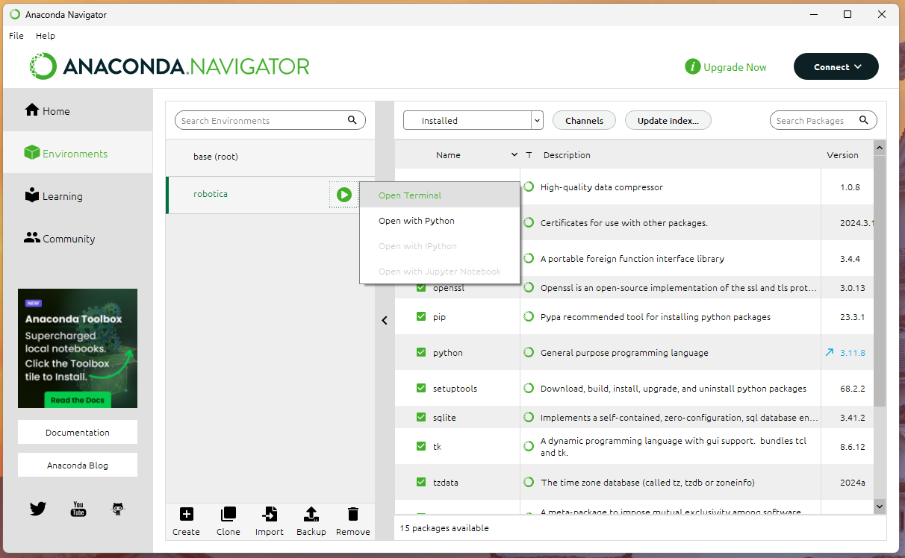
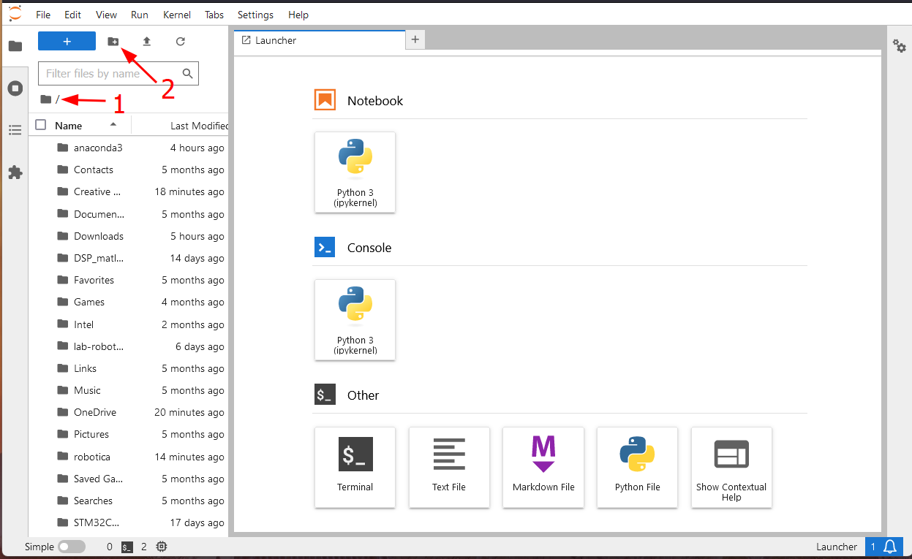
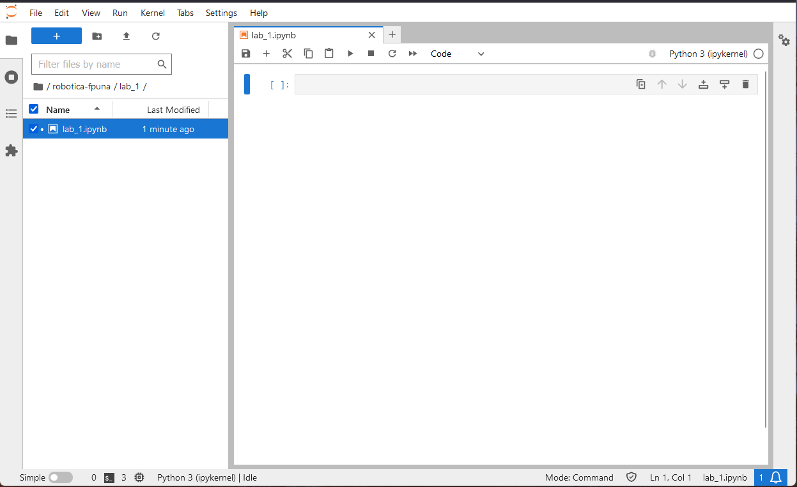

# Práctica de Laboratorio N° 1

## Instalación y preparación del entorno de desarrollo

### Introducción

Este material cumple un papel dual. Por un lado es informativo, ya que muestra cómo realizar la instalación y configuración de todo lo necesario para las prácticas de laboratorio de Robótica. Por otro lado, cumple un papel unificador con el que se espera que los alumnos puedan disponer de instalaciones similares y consistentes tanto en términos de versiones de software como herramientas de desarrollo.
Unificar los ambientes de trabajo entre todos los alumnos, así como del plantel docente nos permitirá minimizar las potenciales fuentes de error, dándonos vía libre para concentrarnos en lo que nos trae, que es la robótica.

Históricamente y desde hace ya varios años, esta materia hizo uso del Toolbox de Robótica de Peter Corke, el cual se instala como una extensión para MATLAB<sup>[1](https://github.com/petercorke/robotics-toolbox-matlab)</sup>. En su última versión el autor ha realizado su migración a Python<sup>[2](https://github.com/petercorke/robotics-toolbox-python)</sup>, lo que ahora nos permite utilizar la herramienta con el mismo set de capacidades que la versión anterior de MATLAB, pero esta vez con un costo de entrada nulo dado que tanto Python como las liberías de las que depende son gratuitas y de código abierto. En contraste y como ya sabemos, MATLAB es una herramienta de pago que si bien puede obtenerse de forma gratuita por algunos medios, nos resulta ahora totalmente prescindible.

En este material se va a cubrir lo siguiente:

1. Descarga e instalación de Anaconda.
2. Creación y configuración de un entorno nuevo con versión específica de Python.
3. Instalación del toolbox de robótica de Peter Corke para Python.
4. Introducción a JupyterLab y flujo de trabajo propuesto.
5. Ejemplo básico de uso.

### Descarga e instalación de Anaconda

Anaconda es una plataforma destinada para facilitar la instalación de dependencias y gestionar entornos de trabajo en Python. Esto nos permite instalar y gestionar diferentes versiones de Python, y a su vez permitir que estas versiones coexistan en un mismo sistema sin generar conflictos en los directorios de instalación, librerías o herramientas como editores de texto, IDEs, etc. Es ideal para nuestro caso de uso ya que nos permite generar entornos de trabajo repetibles incluso para diferentes sistemas operativos. Estas instrucciones van a tener como objetivo principal a usuarios de Windows, pero a menos que se indique lo contrario, deberían ser aplicables para sistemas tipo Linux o MacOS.

Se puede descargar Anaconda para tu sistema operativo de elección a partir del siguiente link:

https://www.anaconda.com/download

Para la instalación en Windows se recomienda mantener los parámetros ofrecidos por defecto por el instalador, esto hará que la instalación de Anaconda sea lo menos invasiva posible, previniendo que se cambie la versión predeterminada de Python que ya pudiese haber estado presente en tu sistema, entre otras cosas.

Una vez instalado, iniciamos la aplicación `Anaconda Navigator` para probar que la instalación haya salido bien. En caso de que el sistema detecte una versión nueva disponible, se mostrará un mensaje para descargarla. Esto no es estrictamente necesario, pero si dispones de tiempo y conexión a internet, siempre es recomendable mantener la distribución actualizada.

### Creación y configuración de un entorno nuevo con versión específica de Python.

Para un funcionamiento consistente del toolbox vamos a crear un nuevo entorno en Anaconda con versiones de software específicas. El motivo para esto es que el entorno base que trae Anaconda, siempre apunta a las últimas versiones disponibles de Python y sus librerías. Nuestro toolbox por el contrario no tiene un mantenimiento muy ágil, lo que conlleva en que necesite versiones estables y usualmente un poco relegadas de varios paquetes.

Para crear un nuevo entorno en Anaconda, se presenta una captura comentada con los pasos:



1. Click en el menú de `Environments`.
2. Click en el botón `create`, lo que abrirá un menú flotante
3. Escribir el nombre del environment, luego de eso se habilitará el menú desplegable para elegir la versión de Python
4. Elegir la versión 3.8.XX
5. Darle click al botón `Create`.

El sistema va a descargar todos los paquetes necesarios, y luego de un tiempo el nuevo environment va a aparecer en la lista del menú. Procedemos a elegirlo.

El siguiente paso consiste en seleccionar nuestro environment personalizado como predeterminado, esto hará que Anaconda utilice esta configuración al abrirse. Para esto vamos al menú `File > Preferences` y luego elegimos el entorno que acabamos de crear en la opción de `Default conda environment`, como se muestra en la siguiente figura:



Confirmamos los cambios y con esto estamos listos para instalar el toolbox.

### Instalación del toolbox de robótica de Peter Corke para Python.

Para instalar el toolbox de robótica tenemos que acceder a un terminal del sistema específico para nuestro environment. Esto se logra yendo al menú de environments, y dando click en el botón verde a la derecha de la opción que deseemos utilizar, y luego en la opción `Open Terminal`, como se muestra en la figura:



Esto nos llevará a un terminal CMD de Windows cuyo prompt tendrá la particularidad de estar precedido por el nombre de nuestro environment entre paréntesis. Esto quiere decir que cualquier cambio que hagamos en la instalación de Python actualmente activa, se hará en dicho environment y no a nivel de sistema.

```
(robotica) PS C:\Users\apojo>
```

Procedemos a instalar el toolbox con el siguiente comando:

```
pip install roboticstoolbox-python
```

Este paso podría tomar un tiempo dependiendo de la velocidad de tu conexión a internet. Una vez finalizado, se debería mostrar un mensaje similar al siguiente, para luego retornar al prompt inicial:

```
Installing collected packages: rtb-data, progress, distlib, colored, websockets, virtualenv, nodeenv, identify, cfgv, ansitable, pre-commit, spatialmath-python, spatialgeometry, pgraph-python, swift-sim, roboticstoolbox-python
Successfully installed ansitable-0.9.10 cfgv-3.4.0 colored-1.4.4 distlib-0.3.8 identify-2.5.35 nodeenv-1.8.0 pgraph-python-0.6.2 pre-commit-3.7.0 progress-1.6 roboticstoolbox-python-1.1.0 rtb-data-1.0.1 spatialgeometry-1.1.0 spatialmath-python-1.1.9 swift-sim-1.1.0 virtualenv-20.25.1 websockets-12.0

(robotica) PS C:\Users\apojo>
```

Ya estamos listos para correr nuestro primer ejemplo en JupyterLab.

### Introducción a JupyterLab y flujo de trabajo propuesto.

Vamos al menú `Home` de Anaconda Navigator, y buscamos entre las aplicaciones el ícono de JupyterLab. Procedemos a instalarlo. Una vez instalado, el botón que previamente decía `Install` ahora dirá `Launch`. Procedemos a lanzarlo. Esto debería abrir nuestro navegador web predeterminado y redireccionarnos a la aplicación.


JupyterLab provee un entorno de desarrollo interactivo para la creación, ejecución y depuración de Jupyter Notebooks. La herramienta nos permite además gestionar directorios y archivos en general, por lo que nos permitirá, entre otras cosas, visualizar las animaciones GIF generadas por el toolbox directamente desde su interfaz, sin necesidad de abrir un visualizador externo.

**Importante**: Este será el entorno que usaremos de manera oficial para el desarrollo de los laboratorios de la clase. Esto quiere decir que el soporte proveído por el plantel se va a centrar en esta herramienta. Para quienes opten por otras herramientas como Visual Studio Code, PyCharm o similares, se les anima a seguir su preferencia, aunque deberán abordar por sí mismos los desafíos técnicos que encuentren.

A primera vista, JupyerLab ofrece una interfaz similar a la de un IDE más tradicional. Con menúes contextuales en la parte superior, una barra de navegación en la parte izquierda, y un editor de texto en la parte central derecha.



Procedemos con lo siguiente:
1. Hacemos click en el ícono de la carpeta señalada en la figura de arriba (flecha 1), lo que nos llevará al directorio raíz de nuestro usuario. Típicamente: `C:\Users\<Nombre de usuario>\`
2. Procedemos a crear una carpeta nueva que será nuestro espacio de trabajo (flecha 2), también llamado *workspace*, para el resto de la materia. Llamamos a la carpeta `robotica-fpuna`. Aquí van a estar ubicados todos los laboratorios de la materia. Considerando que los notebooks suelen crear archivos al ejecutarse, como por ejemplo animaciones GIF, es recomendable tener una subcarpeta para cada laboratorio.
3. Para esto accedemos a la carpeta `robotica-fpuna` haciendo doble click y una vez adentro, procedemos a crear una subcarpeta llamada `lab_1`.
4. Hacemos doble click en `lab1` y finalmente procedemos a crear un nuevo notebook. Para esto vamos al menú `File > New > Notebook`.
5. Se nos aparecerá un menú para seleccionar el tipo de notebook, dejamos la opción por defecto `Python 3 (ipykernel)`, marcamos además la opción de `Always start the preferred kernel`. Finalmente damos click en `Select`. Nuestro nuevo notebook proceerá a abrirse.
6. Antes de agregar cambios es importante darle un nombre al archivo para que así podamos hacer guardados recurrentes. Para esto vamos nuevamente al menú `File > Save Notebook`. Elegimos el nombre `lab_1`, conservando la extensión `.ipynb` que se ofrece por defecto en la interfaz. Damos click en `Rename`.

Si todo salió bien, en este momento deberíamos tener nuestro notebook correctamente nombrado, guardado en la ubicación `C:\Users\<Nombre de usuario>\robotica-fpuna\lab_1\lab_1.ipynb`, y debería verse similar a la imagen siguiente:



### Ejemplo básico de uso.

El siguiente ejemplo es una versión simplificada del que ofrece Peter Corke en el repositorio oficial del toolbox<sup>[3](https://github.com/petercorke/robotics-toolbox-python?tab=readme-ov-file#code-examples)</sup>.
 Para esto procedemos a crear las siguientes celdas en nuestro notebook para el lab1:

 ```
import roboticstoolbox as rtb # 1
robot = rtb.models.Panda() # 2
print(robot) # 3
 ```

1. Este código importa el toolbox a nuestro workspace de Python bajo el nombre `rtb`, para simplificar las referencias posteriores.
2. Se importa el robot manipulador llamado Panda, uno de los robots de ejemplo incluidos en la base de datos del toolbox.
3. Como último paso, se procede a imprimir la configuración de dicho robot en forma tabular con todos los detalles morfológicos del mismo.

Procedemos a ejecutar la celda haciendo `Ctrl + Enter`. A continuación, deberíamos ver el siguiente resultado:

```
	ERobot: panda (by Franka Emika), 7 joints (RRRRRRR), 1 gripper, geometry, collision
	┌─────┬──────────────┬───────┬─────────────┬────────────────────────────────────────────────┐
	│link │     link     │ joint │   parent    │              ETS: parent to link               │
	├─────┼──────────────┼───────┼─────────────┼────────────────────────────────────────────────┤
	│   0 │ panda_link0  │       │ BASE        │                                                │
	│   1 │ panda_link1  │     0 │ panda_link0 │ SE3(0, 0, 0.333) ⊕ Rz(q0)                      │
	│   2 │ panda_link2  │     1 │ panda_link1 │ SE3(-90°, -0°, 0°) ⊕ Rz(q1)                    │
	│   3 │ panda_link3  │     2 │ panda_link2 │ SE3(0, -0.316, 0; 90°, -0°, 0°) ⊕ Rz(q2)       │
	│   4 │ panda_link4  │     3 │ panda_link3 │ SE3(0.0825, 0, 0; 90°, -0°, 0°) ⊕ Rz(q3)       │
	│   5 │ panda_link5  │     4 │ panda_link4 │ SE3(-0.0825, 0.384, 0; -90°, -0°, 0°) ⊕ Rz(q4) │
	│   6 │ panda_link6  │     5 │ panda_link5 │ SE3(90°, -0°, 0°) ⊕ Rz(q5)                     │
	│   7 │ panda_link7  │     6 │ panda_link6 │ SE3(0.088, 0, 0; 90°, -0°, 0°) ⊕ Rz(q6)        │
	│   8 │ @panda_link8 │       │ panda_link7 │ SE3(0, 0, 0.107)                               │
	└─────┴──────────────┴───────┴─────────────┴────────────────────────────────────────────────┘

	┌─────┬─────┬────────┬─────┬───────┬─────┬───────┬──────┐
	│name │ q0  │ q1     │ q2  │ q3    │ q4  │ q5    │ q6   │
	├─────┼─────┼────────┼─────┼───────┼─────┼───────┼──────┤
	│  qr │  0° │ -17.2° │  0° │ -126° │  0° │  115° │  45° │
	│  qz │  0° │  0°    │  0° │  0°   │  0° │  0°   │  0°  │
	└─────┴─────┴────────┴─────┴───────┴─────┴───────┴──────┘
```

Con esto terminamos la primera práctica de laboratorio de robótica. Se espera que con esto cada alumno tenga un entorno de trabajo completamente configurado y funcional, además de un flujo de trabajo sugerido para ésta y el resto de las prácticas a realizarse a lo largo de la materia. Para cualquier consulta o comentario, por favor referirse al grupo de Whatsapp de la materia.
